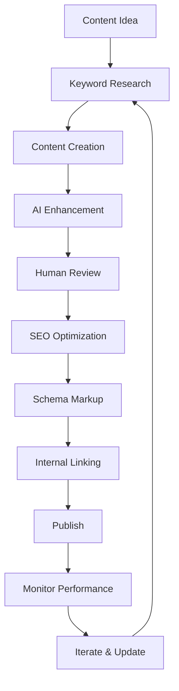

# HerbCraft Content Management & SEO Strategy

## Content Architecture

### 1. Content Types

#### Herb Profiles
```yaml
Structure:
  - URL: /herbs/{slug}
  - Example: /herbs/chamomile
  
Frontmatter:
  title: "Chamomile: Complete Guide to Benefits, Uses & Growing"
  description: "Discover chamomile's calming properties, medicinal uses, recipes, and growing tips. Learn about German vs Roman chamomile varieties."
  slug: chamomile
  commonName: Chamomile
  scientificName: Matricaria chamomilla
  family: Asteraceae
  tags: [calming, digestive, anti-inflammatory, sleep-aid]
  schema: HerbProfile
  lastModified: 2024-01-01
  author: expert-herbalist-id
```

#### Recipe Pages
```yaml
Structure:
  - URL: /recipes/{slug}
  - Example: /recipes/chamomile-honey-tea
  
Frontmatter:
  title: "Soothing Chamomile Honey Tea Recipe"
  description: "Learn to make the perfect chamomile tea with honey for relaxation and better sleep. Simple 5-minute recipe."
  slug: chamomile-honey-tea
  category: beverage
  cuisine: herbal
  prepTime: 5
  cookTime: 10
  servings: 2
  difficulty: easy
  herbs: [chamomile, lavender]
  healthBenefits: [sleep, digestion, anxiety]
  schema: Recipe
```

#### Programmatic Pages
```yaml
Templates:
  - /herbs/{herb}/for-{condition}
  - /herbs/{herb}/recipes
  - /herbs/{herb}/growing-guide
  - /remedies/for-{condition}
  - /herbs/by-{property}
  - /recipes/{cuisine}-herbal-recipes
```

### 2. Content File Structure

```
content/
├── herbs/
│   ├── _data/
│   │   ├── herbs.json         # Master herb database
│   │   └── properties.json    # Herb properties taxonomy
│   ├── profiles/
│   │   ├── chamomile.md
│   │   ├── lavender.md
│   │   └── ...
│   └── _templates/
│       ├── herb-profile.njk
│       └── herb-card.njk
├── recipes/
│   ├── _data/
│   │   └── recipes.json
│   ├── culinary/
│   ├── remedies/
│   ├── beauty/
│   └── _templates/
├── blog/
│   ├── 2024/
│   └── _templates/
├── guides/
│   ├── growing/
│   ├── harvesting/
│   └── preparation/
└── programmatic/
    ├── _generators/
    └── _templates/
```

## SEO Implementation

### 1. Technical SEO

#### Meta Tags Template
```html
<!-- Base Meta Tags -->
<meta charset="UTF-8">
<meta name="viewport" content="width=device-width, initial-scale=1.0">
<title>{{ title }} | HerbCraft</title>
<meta name="description" content="{{ description }}">
<link rel="canonical" href="{{ canonical }}">

<!-- Open Graph -->
<meta property="og:title" content="{{ title }}">
<meta property="og:description" content="{{ description }}">
<meta property="og:image" content="{{ image }}">
<meta property="og:url" content="{{ url }}">
<meta property="og:type" content="website">

<!-- Twitter Card -->
<meta name="twitter:card" content="summary_large_image">
<meta name="twitter:title" content="{{ title }}">
<meta name="twitter:description" content="{{ description }}">
<meta name="twitter:image" content="{{ image }}">

<!-- Additional SEO -->
<meta name="robots" content="index, follow">
<meta name="author" content="HerbCraft">
<link rel="alternate" hreflang="en" href="{{ url }}">
```

#### JSON-LD Schema Templates

**Herb Profile Schema:**
```javascript
{
  "@context": "https://schema.org",
  "@type": "Article",
  "mainEntityOfPage": {
    "@type": "WebPage",
    "@id": "{{ url }}"
  },
  "headline": "{{ title }}",
  "description": "{{ description }}",
  "image": "{{ primaryImage }}",
  "author": {
    "@type": "Organization",
    "name": "HerbCraft"
  },
  "publisher": {
    "@type": "Organization",
    "name": "HerbCraft",
    "logo": {
      "@type": "ImageObject",
      "url": "https://herbcraft.com/logo.png"
    }
  },
  "datePublished": "{{ datePublished }}",
  "dateModified": "{{ dateModified }}",
  "about": {
    "@type": "Plant",
    "name": "{{ commonName }}",
    "scientificName": "{{ scientificName }}",
    "additionalProperty": [
      {
        "@type": "PropertyValue",
        "name": "Family",
        "value": "{{ family }}"
      },
      {
        "@type": "PropertyValue",
        "name": "Medicinal Properties",
        "value": "{{ properties }}"
      }
    ]
  }
}
```

**Recipe Schema:**
```javascript
{
  "@context": "https://schema.org",
  "@type": "Recipe",
  "name": "{{ title }}",
  "description": "{{ description }}",
  "image": "{{ image }}",
  "author": {
    "@type": "Organization",
    "name": "HerbCraft"
  },
  "prepTime": "PT{{ prepTime }}M",
  "cookTime": "PT{{ cookTime }}M",
  "totalTime": "PT{{ totalTime }}M",
  "recipeYield": "{{ servings }} servings",
  "recipeCategory": "{{ category }}",
  "recipeCuisine": "{{ cuisine }}",
  "recipeIngredient": {{ ingredients | json }},
  "recipeInstructions": [
    
    {
      "@type": "HowToStep",
      "text": "{{ step.text }}"
    },
    
  ],
  "nutrition": {
    "@type": "NutritionInformation",
    "servingSize": "1 serving"
  },
  "aggregateRating": {
    "@type": "AggregateRating",
    "ratingValue": "{{ rating }}",
    "ratingCount": "{{ ratingCount }}"
  }
}
```

### 2. Programmatic SEO Strategy

#### Page Generation Templates

**Herb + Condition Pages:**
```javascript
// Template: /herbs/{herb}/for-{condition}
// Example: /herbs/chamomile/for-anxiety

const generateHerbConditionPages = async () => {
  const herbs = await loadHerbData();
  const conditions = await loadConditionsData();
  const pages = [];
  
  herbs.forEach(herb => {
    herb.conditions.forEach(condition => {
      pages.push({
        url: `/herbs/${herb.slug}/for-${condition.slug}`,
        title: `${herb.commonName} for ${condition.name}: Benefits & Usage Guide`,
        description: `Discover how ${herb.commonName} can help with ${condition.name}. Learn about dosage, preparation methods, and scientific evidence.`,
        content: generateContent(herb, condition),
        schema: generateSchema(herb, condition)
      });
    });
  });
  
  return pages;
};
```

**Location-Based Pages:**
```javascript
// Template: /herbs/grow-{herb}-in-{location}
// Example: /herbs/grow-lavender-in-california

const generateLocationPages = async () => {
  const herbs = await loadHerbData();
  const locations = ['california', 'texas', 'florida', 'new-york', ...];
  
  return herbs.flatMap(herb => 
    locations.map(location => ({
      url: `/herbs/grow-${herb.slug}-in-${location}`,
      title: `Growing ${herb.commonName} in ${capitalize(location)}: Complete Guide`,
      description: `Learn how to successfully grow ${herb.commonName} in ${capitalize(location)}'s climate. Tips for planting, care, and harvesting.`,
      content: generateLocationContent(herb, location)
    }))
  );
};
```

### 3. Content Automation Pipeline

#### AI Content Generation
```javascript
// scripts/content-generator.js
const { Configuration, OpenAIApi } = require('openai');

class ContentGenerator {
  constructor(apiKey) {
    this.openai = new OpenAIApi(new Configuration({ apiKey }));
  }
  
  async generateHerbProfile(herb) {
    const prompt = `
      Write a comprehensive herb profile for ${herb.commonName} (${herb.scientificName}).
      Include:
      1. Overview and history
      2. Medicinal properties and benefits
      3. Traditional uses
      4. Modern research
      5. Safety and contraindications
      
      Format: Markdown with proper headings
      Tone: Educational, authoritative, accessible
      Length: 800-1000 words
    `;
    
    const response = await this.openai.createCompletion({
      model: "gpt-4",
      prompt,
      max_tokens: 1500,
      temperature: 0.7
    });
    
    return this.processAndValidate(response.data.choices[0].text);
  }
  
  async generateRecipeVariations(baseRecipe) {
    // Generate variations for different dietary needs, seasons, etc.
  }
  
  async generateFAQs(topic) {
    // Generate relevant Q&As for schema markup
  }
}
```

#### Content Validation
```javascript
class ContentValidator {
  validate(content) {
    const checks = {
      length: content.length > 300,
      headings: this.hasProperHeadings(content),
      keywords: this.hasTargetKeywords(content),
      readability: this.checkReadability(content),
      facts: this.verifyFacts(content),
      uniqueness: this.checkUniqueness(content)
    };
    
    return {
      isValid: Object.values(checks).every(v => v),
      checks
    };
  }
  
  hasProperHeadings(content) {
    const h2Count = (content.match(/## /g) || []).length;
    const h3Count = (content.match(/### /g) || []).length;
    return h2Count >= 3 && h3Count >= 2;
  }
  
  checkReadability(content) {
    // Implement Flesch-Kincaid score
    // Target: 60-70 (high school level)
  }
}
```

### 4. SEO Monitoring & Optimization

#### Performance Metrics
```javascript
// Track and optimize:
const seoMetrics = {
  technical: {
    pageSpeed: 'Core Web Vitals',
    mobileUsability: 'Mobile-friendly test',
    indexability: 'Robots.txt, sitemap.xml',
    structuredData: 'Schema validation'
  },
  content: {
    keywordRankings: 'Target keywords positions',
    organicTraffic: 'GA4 integration',
    engagement: 'Time on page, bounce rate',
    conversions: 'Newsletter signups, affiliate clicks'
  },
  authority: {
    backlinks: 'Quality and quantity',
    brandMentions: 'Social signals',
    expertContributions: 'E-A-T signals'
  }
};
```

### 5. Content Calendar & Publishing Schedule

#### Editorial Calendar
```yaml
Weekly Publishing Schedule:
  Monday:
    - New herb profile
    - Related recipes (2-3)
  
  Wednesday:
    - Educational guide
    - Seasonal content
  
  Friday:
    - Community spotlight
    - User-generated content
  
  Daily:
    - Social media posts
    - Forum moderation
    - AI chat responses

Monthly Features:
  - Expert interviews
  - Seasonal herb guides
  - Research summaries
  - Video tutorials
```

### 6. Internal Linking Strategy

#### Automated Linking Rules
```javascript
const linkingRules = {
  herbProfiles: {
    // Link to related herbs
    relatedHerbs: 3,
    // Link to recipes using this herb
    recipes: 5,
    // Link to conditions it treats
    conditions: 3,
    // Link to growing guide
    growingGuide: 1
  },
  recipes: {
    // Link to all herbs used
    herbs: 'all',
    // Link to similar recipes
    similar: 3,
    // Link to health benefits
    benefits: 2
  },
  guides: {
    // Link to relevant herbs
    herbs: 5,
    // Link to tools/products
    affiliates: 2
  }
};
```

### 7. Sitemap Generation

#### Dynamic Sitemap
```javascript
// scripts/generate-sitemap.js
const generateSitemap = async () => {
  const urls = [];
  
  // Static pages
  const staticPages = [
    { url: '/', priority: 1.0, changefreq: 'daily' },
    { url: '/herbs', priority: 0.9, changefreq: 'daily' },
    { url: '/recipes', priority: 0.9, changefreq: 'daily' },
    { url: '/community', priority: 0.8, changefreq: 'hourly' },
    { url: '/ai-advisor', priority: 0.8, changefreq: 'weekly' }
  ];
  
  // Dynamic pages
  const herbs = await getHerbs();
  const herbUrls = herbs.map(herb => ({
    url: `/herbs/${herb.slug}`,
    priority: 0.8,
    changefreq: 'weekly',
    lastmod: herb.lastModified
  }));
  
  const recipes = await getRecipes();
  const recipeUrls = recipes.map(recipe => ({
    url: `/recipes/${recipe.slug}`,
    priority: 0.7,
    changefreq: 'monthly',
    lastmod: recipe.lastModified
  }));
  
  // Programmatic pages
  const programmaticUrls = await generateProgrammaticUrls();
  
  return [...staticPages, ...herbUrls, ...recipeUrls, ...programmaticUrls];
};
```

### 8. Content Optimization Workflow



### 9. E-A-T (Expertise, Authoritativeness, Trustworthiness)

#### Implementation Strategy
1. **Expert Contributors**
   - Verified herbalist profiles
   - Author bio boxes
   - Credentials display

2. **Medical Disclaimers**
   - Prominent placement
   - Specific to content type
   - Legal review

3. **Citations & References**
   - Scientific studies
   - Traditional sources
   - Expert quotes

4. **Trust Signals**
   - SSL certificate
   - Privacy policy
   - Terms of service
   - Contact information
   - About page

### 10. International SEO

#### Multi-language Support
```javascript
// Hreflang implementation
const hreflangTags = [
  { lang: 'en', url: 'https://herbcraft.com' },
  { lang: 'es', url: 'https://es.herbcraft.com' },
  { lang: 'fr', url: 'https://fr.herbcraft.com' },
  { lang: 'de', url: 'https://de.herbcraft.com' }
];

// Content translation workflow
const translationPipeline = {
  priority: ['herb-profiles', 'popular-recipes', 'guides'],
  method: 'professional + AI review',
  culturalAdaptation: true
};
```

This comprehensive content and SEO strategy ensures HerbCraft will rank well in search engines while providing valuable, trustworthy content to users.